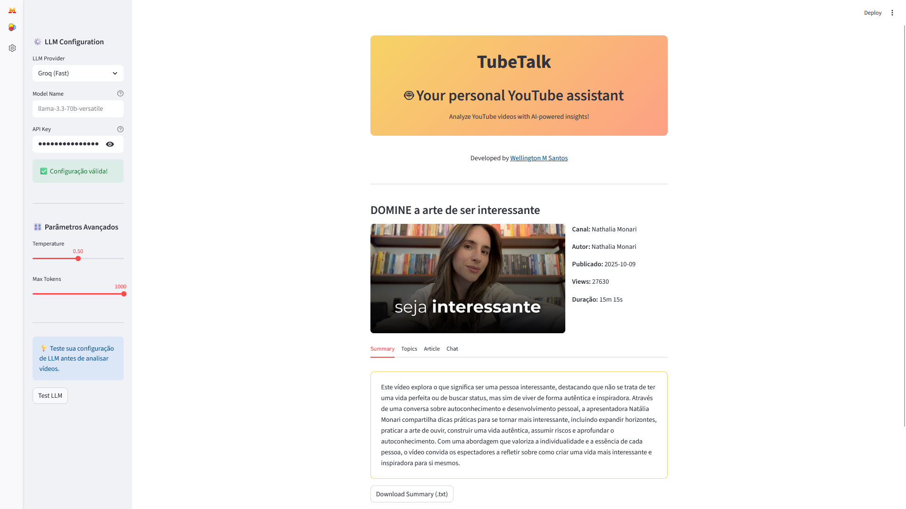

# TubeTalk
[](https://www.python.org/downloads/)
[](https://streamlit.io/)
[](LICENSE)

**TubeTalk** é um aplicativo web baseado em Python que permite aos usuários analisar vídeos do YouTube, extraindo transcrições e metadados, gerando resumos, tópicos-chave e artigos completos com o auxílio de modelos de linguagem avançados (LLMs). A interface, construída com Streamlit, oferece uma experiência interativa com visualização de metadados, análises e um chat contextual para perguntas relacionadas ao vídeo.

Desenvolvido por [Wellington M. Santos](https://www.linkedin.com/in/wellington-moreira-santos).



## Funcionalidades

- **Extração de Dados do YouTube**: Obtém transcrições e metadados (título, autor, canal, data de publicação, visualizações, duração, etc.) de vídeos do YouTube usando `youtube_transcript_api` e `yt_dlp`.
- **Processamento com LLMs**: Gera resumos, extrai tópicos-chave e cria artigos baseados em transcrições, utilizando provedores como OpenAI, Groq, Ollama e HuggingFace.
- **Interface Interativa**: Interface web com Streamlit que exibe metadados, análises (resumo, tópicos, artigo) e permite interação via chat com contexto do vídeo.
- **Configuração Flexível**: Suporta múltiplos provedores de LLM com configuração de modelo, temperatura e número máximo de tokens.
- **Exportação de Resultados**: Permite baixar resumos, tópicos e artigos em formatos `.txt` e `.md`.

## Estrutura do Projeto

O projeto é composto por três módulos principais:

1. **`youtube_service.py`**: Extrai transcrições e metadados de vídeos do YouTube.
2. **`llm_service.py`**: Processa transcrições usando LLMs para gerar resumos, tópicos e artigos.
3. **`ui.py`**: Interface de usuário web com Streamlit, integrando os serviços acima.

## Requisitos

- Python 3.8 ou superior
- Gerenciador de pacotes **uv** (para gerenciamento de dependências via `pyproject.toml`).  

  > **Nota:** O [uv](https://github.com/astral-sh/uv) é um gerenciador de dependências ultrarrápido para Python, compatível com arquivos `pyproject.toml`. Ele foi escolhido por sua velocidade e simplicidade em relação a alternativas como `pip` ou `poetry`, facilitando a instalação e sincronização de dependências em projetos modernos.

- Dependências especificadas em `pyproject.toml`, incluindo:
  - `streamlit`
  - `youtube_transcript_api`
  - `yt_dlp`
  - `python-dotenv`
  - `langchain`
  - `langchain-community`
  - `langchain-openai`
  - `langchain-groq`

## Instalação

1. **Clone o repositório**:
   ```bash
   git clone https://github.com/esscova/tubetalk.git
   cd tubetalk
   ```

2. **Instale o uv** (se ainda não estiver instalado):
   ```bash
   pip install uv
   ```

3. **Crie um ambiente virtual com uv**:
   ```bash
   uv venv
   source .venv/bin/activate  # Linux/Mac
   .venv\Scripts\activate     # Windows
   ```

4. **Sincronize as dependências com uv**:
   ```bash
   uv sync
   ```
   Isso instalará todas as dependências listadas no arquivo `pyproject.toml`.

5. **Configure as chaves de API**:
   Crie um arquivo `.env` na raiz do projeto com as chaves de API necessárias:
   ```plaintext
   OPENAI_API_KEY=your-openai-key
   GROQ_API_KEY=your-groq-key
   HUGGINGFACEHUB_API_TOKEN=your-huggingface-key
   ```
   Observação: Ollama não requer chave de API, mas deve estar em execução localmente.

6. **Configure os templates de prompt** (se necessário):
   Certifique-se de que o módulo `configs.prompts` contém os templates `SUMMARY_PROMPT_TEMPLATE`, `TOPICS_PROMPT_TEMPLATE` e `ARTICLE_PROMPT_TEMPLATE`. Exemplo:
   ```python
   # configs/prompts.py
   SUMMARY_PROMPT_TEMPLATE = "Resuma o seguinte texto em 3-5 frases: {transcript}"
   TOPICS_PROMPT_TEMPLATE = "Extraia os tópicos principais do texto: {transcript}"
   ARTICLE_PROMPT_TEMPLATE = "Escreva um artigo com base no texto: {transcript}"
   ```

## Uso

1. **Execute o aplicativo**:
   ```bash
   streamlit run ./src/main.py
   ```

2. **Acesse a interface**:
   - Abra o navegador no endereço fornecido (geralmente `http://localhost:8501`).
   - Insira uma URL de vídeo do YouTube (ex.: `https://www.youtube.com/watch?v=Sm5jALppTLE`).
   - Configure o provedor de LLM, modelo, chave de API (se necessário), temperatura e máximo de tokens na barra lateral.
   - Clique em **Analisar Vídeo** para extrair metadados e gerar análises.

3. **Funcionalidades da interface**:
   - **Metadados**: Visualize título, canal, autor, data, visualizações e duração.
   - **Abas de análise**:
     - **Summary**: Exibe o resumo do vídeo com opção de download (`.txt`).
     - **Topics**: Lista os tópicos principais com opção de download (`.txt`).
     - **Article**: Mostra o artigo gerado com opção de download (`.md`).
     - **Chat**: Permite perguntas contextuais sobre o vídeo (título, descrição, tags, resumo, transcrição).
   - **Analisar Outro Vídeo**: Redefine a interface para processar um novo vídeo.

## Exemplo de Uso

```python
from ui import UI

# Inicializa e executa a interface
ui = UI()
ui.run()
```

Na interface:
1. Insira a URL: `https://www.youtube.com/watch?v=Sm5jALppTLE`.
2. Escolha o provedor (ex.: `groq`), modelo (ex.: `llama-3.3-70b-versatile`) e insira a chave de API.
3. Clique em **Analisar Vídeo**.
4. Navegue pelas abas para visualizar resumo, tópicos e artigo.
5. Use a aba **Chat** para fazer perguntas como: "Qual é o tema principal do vídeo?".

## Configuração de LLMs

- **OpenAI**: Requer chave de API (`OPENAI_API_KEY`). Modelo padrão: `gpt-3.5-turbo`.
- **Groq**: Requer chave de API (`GROQ_API_KEY`). Modelo padrão: `llama-3.3-70b-versatile`.
- **HuggingFace**: Requer chave de API (`HUGGINGFACEHUB_API_TOKEN`). Modelo padrão: `mistralai/Mistral-7B-Instruct-v0.1`.
- **Ollama**: Não requer chave de API, mas precisa estar em execução localmente. Modelo padrão: `llama2`.

Teste a configuração do LLM na barra lateral antes de analisar vídeos.

## Limitações

- **YouTube**:
  - Depende da disponibilidade da API de transcrições do YouTube.
  - Vídeos privados ou com restrições de idade/região podem não ser processados.
- **LLMs**:
  - Requer chaves de API válidas para OpenAI, Groq e HuggingFace.
  - O desempenho depende do modelo e provedor selecionados.
- **Interface**:
  - Suporta apenas um vídeo por sessão.
  - O chat usa apenas os primeiros 800 caracteres da transcrição para contexto.

## Contribuição

Contribuições são bem-vindas! Para contribuir:
1. Faça um fork do repositório.
2. Crie uma branch para sua feature (`git checkout -b feature/nova-funcionalidade`).
3. Commit suas alterações (`git commit -m 'Adiciona nova funcionalidade'`).
4. Envie para o repositório remoto (`git push origin feature/nova-funcionalidade`).
5. Abra um Pull Request.

## Licença

Este projeto está licenciado sob a [MIT License](LICENSE).

## Contato

Desenvolvido por [Wellington M. Santos](https://www.linkedin.com/in/wellington-moreira-santos). Para dúvidas ou sugestões, abra uma issue no repositório ou entre em contato via LinkedIn.